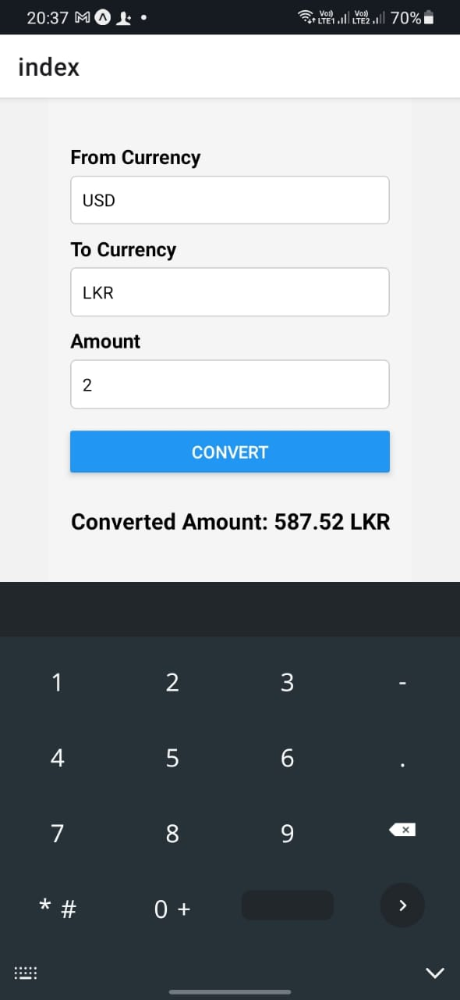
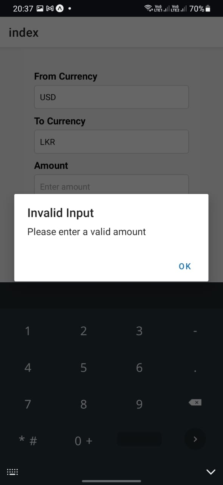

# Currency Converter App

## Overview

The **Currency Converter App** is a simple and interactive React Native application that allows users to convert amounts from one currency to another using real-time exchange rates. It demonstrates fundamental concepts of React Native and serves as an excellent first project for understanding mobile app development.

---

## Features

- **Real-Time Conversion**: Fetches up-to-date exchange rates for accurate conversions.
- **Interactive UI**: Simple and intuitive user interface with input validation.
- **Error Handling**: Provides user feedback for invalid inputs or API failures.
- **Loading Indicator**: Displays an activity indicator during API calls for better user experience.
- **Responsive Design**: Designed to look good on various screen sizes.

---

## Technologies Used

- **React Native**: Core framework for building the app.
- **JavaScript**: Language used for functionality.
- **Exchange Rate API**: External API to fetch live exchange rates.

---

## Screenshots


*The main screen of the Currency Converter App* 

*The Error(Alert) screen of the Currency Converter App*

---

## Setup and Installation

### Prerequisites

1. **Node.js** (Version 14 or above): Install from [Node.js Official Website](https://nodejs.org/).
2. **React Native CLI**: Follow the [React Native Getting Started Guide](https://reactnative.dev/docs/environment-setup) to set up your environment.
3. **Expo Go App** (Optional): For testing the app on your physical device.

### Steps

1. **Clone the Repository**
   ```bash
   git clone https://github.com/LayuruLK/Currency_Converter_With_React_native.git
   cd currency-converter
   ```

2. **Install Dependencies**
   ```bash
   npm install
   ```

3. **Start the Development Server**
   ```bash
   npx react-native start
   ```

4. **Run the App**
   - For Android:
     ```bash
     npx react-native run-android
     ```
   - For iOS:
     ```bash
     npx react-native run-ios
     ```

5. **Test the App**: Enter the currency details and amount to see the conversion in real-time.

---

## Project Structure

```
.
├── components
│   └── Converter.js       # Main conversion logic and UI
├── utils
│   └── api.js             # Fetch exchange rates from external API
├── App.js                 # Root component
├── package.json           # Project configuration
├── README.md              # Documentation
```

---

## Implementation Details

### 1. **Converter Component**

The `Converter` component handles:
- Input fields for `fromCurrency`, `toCurrency`, and `amount`.
- Fetching exchange rates via `fetchExchangeRate`.
- Displaying the converted amount.
- Error handling and loading indicators.

#### Code Snippet
```javascript
const convertCurrency = async () => {
    if (!amount || isNaN(amount) || parseFloat(amount) <= 0) {
        Alert.alert('Invalid Input', 'Please enter a valid amount');
        return;
    }
    setIsLoading(true);
    try {
        const rate = await fetchExchangeRate(fromCurrency, toCurrency);
        setConvertedAmount((rate * parseFloat(amount)).toFixed(2));
    } catch (error) {
        Alert.alert('Error', 'Failed to fetch exchange rate. Please try again.');
    } finally {
        setIsLoading(false);
    }
};
```

### 2. **API Utility**

The `fetchExchangeRate` function in `utils/api.js` communicates with an external API to retrieve exchange rates.

#### Code Snippet
```javascript
export const fetchExchangeRate = async (from, to) => {
    const response = await fetch(`https://api.exchangerate-api.com/v4/latest/${from}`);
    const data = await response.json();
    return data.rates[to];
};
```

---

## Steps Taken

1. **Project Initialization**:
   - Created a new React Native project using `npx react-native init currency-converter`.

2. **Implemented UI**:
   - Designed the `Converter` component with user-friendly input fields and buttons.

3. **Integrated API**:
   - Used `fetch` to get real-time exchange rates from an external API.

4. **Added Features**:
   - Input validation.
   - Error handling and loading indicators.

5. **Tested Responsiveness**:
   - Verified the app's UI on different devices and screen sizes.

6. **Made Multiple Commits**:
   - Incrementally added features with meaningful commit messages.

---

## Future Improvements

- Add support for multiple languages.
- Allow users to save favorite currency pairs.
- Enhance the UI with custom themes and animations.

---

## Contribution

Contributions are welcome! Please feel free to fork the repository and submit a pull request.

---

## License

This project is licensed under the MIT License. See the `LICENSE` file for more information.

---

## Acknowledgments

- [Exchange Rate API](https://www.exchangerate-api.com/) for providing free exchange rates.
- React Native community for their excellent documentation and support.

---

## Author

**Your Name**  
GitHub: [GitHub Profile](https://github.com/LayuruLK)  
Email: layurulakvidukarunathilaka@gmail.com
